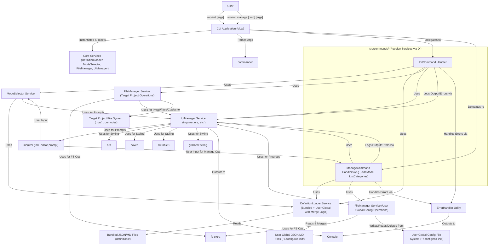

# Roo Init CLI Architecture Document

## Technical Summary

The Roo Init CLI is a Node.js application built with TypeScript, designed to streamline project initialization. It allows developers to select predefined 'modes' (bundling configurations and custom instructions) and associated 'rules' (guideline files) through interactive prompts or command-line arguments. The tool then copies the selected mode definitions into a `.roomodes` JSON file and the corresponding rule files into a standardized `.roo` directory structure within the target project.

New with Epic 4, the CLI now supports user-defined custom modes and categories, which are stored globally in the user's configuration directory (e.g., `~/.config/roo-init/`) and managed via a new `roo-init manage` command suite offering CRUD operations. This includes an in-CLI mechanism for creating and editing custom Markdown rule files, leveraging `inquirer`'s editor prompt capabilities. The `DefinitionLoader` service has been enhanced to load both bundled system definitions and these user-defined custom definitions, with custom definitions taking precedence in case of slug conflicts.

Key technologies include `commander` for argument parsing, `inquirer` for interactive prompts (including editor prompts for rule content), `fs-extra` for robust file system operations (for both project and global user configurations), and libraries like `ora`, `boxen`, `cli-table3`, and `gradient-string` for an enhanced CLI user experience. The architecture emphasizes modularity and Dependency Injection (DI) for core services, separating concerns between command handling (for both `init` and `manage` commands), core logic (definition loading from bundled and user sources, mode selection, file management), and UI/utilities. This aims for high maintainability, testability, and suitability for AI agent implementation, aligning with the goals outlined in the PRD ([`docs/prd.md:9`](docs/prd.md:9)).

## High-Level Overview

The Roo Init CLI follows a **Modular Monolith** architectural style suitable for a command-line tool. It operates as a single executable process but is internally structured into distinct, loosely coupled modules.

The primary user interaction flows are as follows:

**A. Initialization Flow (`roo-init`):**
1.  User executes the `roo-init` command in their terminal within a target project directory.
2.  The CLI application starts ([`src/cli.ts`](src/cli.ts:0)). Core services (DefinitionLoader, ModeSelector, FileManager, UiManager) are instantiated.
3.  `commander` parses command-line arguments (`--help`, `--version`, `--modes`, `--category`, `--force`).
4.  The `InitCommand` handler receives necessary services via DI.
5.  Core definitions (modes, categories, rules) are loaded by the `DefinitionLoader` service from **both bundled system JSON files and the user's global configuration directory (e.g., `~/.config/roo-init/user-definitions.json`), with user definitions taking precedence in case of slug conflicts.**
6.  Based on parsed arguments for `roo-init`:
    *   If `--help` or `--version` (for the `init` command scope), display relevant info and exit.
    *   If `--modes` or `--category` are provided (non-interactive), the `ModeSelector` service validates slugs (against the merged definition list) and resolves the final mode list.
    *   Otherwise (interactive for `init`), the `ModeSelector` service uses `inquirer` (via `UiManager`) to prompt the user for category and mode selection from the merged list.
7.  The `FileManager` service handles file operations for the **target project**, using `UiManager` for progress indicators:
    *   Checks for existing files/directories in the target project.
    *   Creates the `.roo` directory structure if needed.
    *   Writes the `.roomodes` JSON file.
    *   Copies relevant rule files (`.md`) from their source (bundled system rules or user-global custom rules) into the target project's `.roo/rules/` and `.roo/rules-[mode_slug]/`.
    *   Respects the `--force` flag for overwriting.
8.  Feedback for the `init` operation is provided via the console, managed by `UiManager` and `ErrorHandler`.

**B. Custom Definition Management Flow (`roo-init manage <subcommand>`):**
1.  User executes a command like `roo-init manage add mode`, `roo-init manage list categories`, etc.
2.  The CLI application starts ([`src/cli.ts`](src/cli.ts:0)). Core services are instantiated as needed.
3.  `commander` parses the `manage` command and its subcommands/arguments.
4.  The corresponding `ManageCommand` handler (e.g., `ManageAddModeCommand`, `ManageListCategoriesCommand`) receives necessary services via DI.
5.  The `DefinitionLoader` service loads existing bundled system and user-global definitions to provide context (e.g., for listing, ensuring slug uniqueness for new custom definitions).
6.  For `add` or `edit` subcommands:
    *   The `UiManager` uses `inquirer` to present comprehensive interactive prompts for all necessary fields (e.g., slug, name, description, rule details).
    *   For rule content, an `inquirer` editor prompt is used for multi-line Markdown input.
7.  The `FileManager` service handles file operations for the **user's global configuration directory** (e.g., `~/.config/roo-init/`):
    *   Reads/writes `user-definitions.json`.
    *   Creates/reads/writes/deletes custom rule files (`.md`) in `~/.config/roo-init/rules/[custom_mode_slug]/`.
    *   Creates necessary subdirectories.
8.  Feedback for `manage` operations is provided via the console, managed by `UiManager` and `ErrorHandler`.

## Component View

The application is structured into several key components located within the `src/` directory, promoting separation of concerns, testability, and clear DI pathways.

```mermaid
graph TD
    subgraph CLI_Main ["src/cli.ts"]
        CLI_Entry["cli.ts (commander setup, DI Root)"]
    end

    subgraph Commands ["src/commands/"]
        InitCmd["init.ts (Handles 'roo-init')"]
        ManageCmds["manage*.ts (Handles 'roo-init manage ...')"]
    end

    subgraph Core_Services ["src/core/ (Injectable Services)"]
        DefLoader["DefinitionLoader.ts (Bundled + User Global Data)"]
        ModeSel["ModeSelector.ts (Uses Merged Definitions)"]
        FileMgr["FileManager.ts (Project & User Global FS Ops)"]
    end

    subgraph Utilities ["src/utils/"]
        Logger["logger.ts"]
        UIManager["uiManager.ts (inquirer, ora, boxen, etc.)"]
        ErrHandler["errorHandler.ts"]
    end

    subgraph SharedTypes ["src/types/"]
        DomainTypes["domain.ts"]
    end

    subgraph ExternalLibs [External Libraries]
        CommanderLib["commander"]
        InquirerLib["inquirer (incl. editor prompt)"]
        OraLib["ora"]
        BoxenLib["boxen"]
        CliTableLib["cli-table3"]
        GradientLib["gradient-string"]
        FsExtraLib["fs-extra"]
    end

    subgraph Data_Sources [Data Sources]
        BundledJsonDefs["definitions/*.json (System)"]
        BundledRuleFiles["definitions/rules/**/*.md (System)"]
        UserGlobalJsonDefs["~/.config/roo-init/user-definitions.json (User Custom)"]
        UserGlobalRuleFiles["~/.config/roo-init/rules/**/*.md (User Custom)"]
    end
    
    CLI_Entry -- Instantiates & Injects --> DefLoader;
    CLI_Entry -- Instantiates & Injects --> ModeSel;
    CLI_Entry -- Instantiates & Injects --> FileMgr;
    CLI_Entry -- Instantiates & Injects --> UIManager;
    CLI_Entry -- Instantiates & Injects --> Logger;
    CLI_Entry -- Instantiates & Injects --> ErrHandler;
    
    CLI_Entry -- Configures & Delegates to --> InitCmd;
    CLI_Entry -- Configures & Delegates to --> ManageCmds;

    InitCmd -- Uses (Injected) --> ModeSel;
    InitCmd -- Uses (Injected) --> FileMgr; 
    InitCmd -- Uses (Injected) --> DefLoader;
    InitCmd -- Uses (Injected) --> UIManager;
    InitCmd -- Uses (Injected) --> Logger;
    InitCmd -- Uses (Injected) --> ErrHandler;

    ManageCmds -- Uses (Injected) --> DefLoader;
    ManageCmds -- Uses (Injected) --> FileMgr; 
    ManageCmds -- Uses (Injected) --> UIManager;
    ManageCmds -- Uses (Injected) --> Logger;
    ManageCmds -- Uses (Injected) --> ErrHandler;

    ModeSel -- Uses (Injected) --> DefLoader;
    ModeSel -- Uses (Injected) --> UIManager; 
    ModeSel -- Uses --> DomainTypes;

    FileMgr -- Uses (Injected) --> UIManager;
    FileMgr -- Uses --> FsExtraLib;
    FileMgr -- Uses (Injected) --> DefLoader; 
    FileMgr -- Uses --> DomainTypes;

    UIManager -- Uses --> InquirerLib;
    UIManager -- Uses --> OraLib;
    UIManager -- Uses --> BoxenLib;
    UIManager -- Uses --> CliTableLib;
    UIManager -- Uses --> GradientLib;

    DefLoader -- Reads --> BundledJsonDefs;
    DefLoader -- Reads --> BundledRuleFiles;
    DefLoader -- Reads & Merges --> UserGlobalJsonDefs;
    DefLoader -- Reads & Merges --> UserGlobalRuleFiles;
    DefLoader -- Uses --> DomainTypes;

    CLI_Entry -- Uses --> CommanderLib;

    style Core_Services fill:#f9f,stroke:#333,stroke-width:2px
    style Commands fill:#ccf,stroke:#333,stroke-width:2px
    style Utilities fill:#cfc,stroke:#333,stroke-width:2px
    style ExternalLibs fill:#ffc,stroke:#333,stroke-width:2px
    style Data_Sources fill:#e6e6fa,stroke:#333,stroke-width:2px
```

- **`src/cli.ts`**: Entry point. Initializes `commander`, defines top-level commands (`init`, `manage`, `--help`, `--version`). Acts as the DI root, instantiating core services and utilities and injecting them into command handlers.
- **`src/commands/`**:
    - **`init.ts`**: Orchestrates the main initialization workflow (`roo-init`). Receives instances of core services and utilities via DI. Determines interactive or non-interactive execution.
    - **`manage*.ts` (e.g., `manageAddMode.ts`, `manageListCategories.ts`, etc.)**: Handlers for the `roo-init manage` subcommands. Each orchestrates a specific CRUD operation for custom modes or categories. They receive necessary services (DefinitionLoader, FileManager, UiManager) via DI and use `UiManager` for interactive prompting.
- **`src/core/DefinitionLoader.ts`**: Responsible for finding, reading, parsing, and validating mode, category, and rule definition files. **It now loads definitions from both the CLI's bundled assets and the user's global configuration directory (e.g., `~/.config/roo-init/user-definitions.json`), merging them and giving precedence to user definitions in case of slug conflicts.** Designed to be injectable and easily testable.
- **`src/core/ModeSelector.ts`**: Encapsulates the logic for selecting modes for the `init` command. Takes `DefinitionLoader` (to access the **merged list of system and custom definitions**) and `UiManager` (for `inquirer` prompts) as injected dependencies. Handles both interactive and non-interactive selection. Designed to be injectable.
- **`src/core/FileManager.ts`**: Handles all interactions with the file system. Takes `UiManager` (for progress indicators) and `DefinitionLoader` (to get rule file info) as injected dependencies. Uses `fs-extra`. **Its responsibilities now cover:**
    - **Target project operations (for `init` command):** Creating `.roo/` structure, writing `.roomodes`, copying rule files (from bundled or user-global sources) to the project.
    - **User-global configuration operations (for `manage` commands):** Reading/writing `user-definitions.json`, creating/reading/writing/deleting custom rule files and their directories within `~/.config/roo-init/rules/`.
    Designed to be injectable.
- **`src/utils/`**:
    - `logger.ts`: Provides basic, unstyled logging capabilities.
    - `uiManager.ts`: Centralizes the usage of `inquirer` (including its editor prompt for rule content in `manage` commands), `ora`, `boxen`, `cli-table3`, and `gradient-string` for a consistent CLI user experience.
    - `errorHandler.ts`: Centralized error handling, formatting user-friendly error messages, and managing exit codes.
- **`src/types/`**: Defines shared TypeScript interfaces, primarily the domain model based on [`docs/data-models.md`](docs/data-models.md:0).

## Key Architectural Decisions & Patterns

- **Modular Monolith:** Chosen for simplicity suitable for a CLI tool, while internal modules provide structure.
- **Dependency Injection (DI):** Core services (`DefinitionLoader`, `FileManager`, `ModeSelector`) and key utilities (`UiManager`, `ErrorHandler`, `Logger`) are designed to be injectable. Instantiated in [`src/cli.ts`](src/cli.ts:0) and passed to command handlers. Enhances testability and modularity.
- **Service Layer (`src/core/`)**: Core logic is encapsulated in dedicated, injectable services.
- **Command Pattern (via `commander`):** `commander` maps CLI commands (e.g., `init`, `manage add mode`) to specific handlers in `src/commands/`. Handlers receive dependencies via DI.
- **TypeScript:** Enforces static typing. Justification: PRD requirement, improves code quality, maintainability, AI agent interaction.
- **`commander` for Argument Parsing:** Robust parsing, validation, help text for main commands and subcommands. Justification: PRD recommendation, industry standard.
- **`inquirer` for Interactive Prompts:** User-friendly, customizable prompts, **including editor prompts for in-CLI Markdown editing of custom rule files.** Justification: Robust features, good UX for complex interactions.
- **CLI UI/UX Enhancement Libraries (`ora`, `boxen`, `cli-table3`, `gradient-string`):** Managed via `UiManager` for a polished user experience. Justification: Improves usability and professional appearance.
- **`fs-extra` for File Operations:** Robust file system interactions for **both target project setup and user-global configuration management.** Justification: Reliability, cross-platform compatibility.
- **Dual Definition Sources (Bundled & User-Global):**
    - **Bundled Definitions (JSON/MD):** System-provided modes/categories/rules, ensuring baseline functionality.
    - **User-Global Custom Definitions (JSON/MD in `~/.config/roo-init/`):** Allows users to create, manage, and persist their own modes, categories, and rule files.
    - **Justification:** Provides core functionality out-of-the-box while offering high customizability and persistence for users.
- **Definition Merging & Precedence:** The `DefinitionLoader` service merges system and user-global definitions, with **user-defined custom definitions taking precedence (overwriting system definitions) in case of slug conflicts.** Justification: Empowers users to override or extend system defaults seamlessly.
- **Centralized UI Management (`src/utils/uiManager.ts`):** Consolidates CLI output styling and all interactive prompt logic (using `inquirer`).
- **Centralized Error Handling (`src/utils/errorHandler.ts`):** Consistent error reporting and exit codes.

## Core Workflow / Sequence Diagrams (Optional)

*(Consider adding sequence diagrams for key workflows if needed for further clarity, for example:
- The interactive `init` flow, showing DI and service interactions.
- A representative `manage` flow, such as `manage add mode`, detailing prompts for mode/rule creation (including rule content editing) and interaction with global configuration files.)*

## Infrastructure and Deployment Overview

- **Cloud Provider(s):** N/A (Local CLI Tool)
- **Core Services Used:** N/A
- **Infrastructure as Code (IaC):** N/A
- **Deployment Strategy:** Packaged as an npm module and published to a registry (e.g., npmjs.com) for installation via `npm install -g roo-init` or `pnpm add -g roo-init`.
  - **Build Process:** `tsc` compiles TypeScript to JavaScript (`build/`), and definition files (`definitions/`) are copied to `build/definitions/`. `package.json` points `bin` to `build/bin/roo-init.js`.
- **Environments:** Primarily `development` (local) and `production` (published npm package).

## Key Reference Documents

- [`docs/prd.md`](docs/prd.md:0)
- [`docs/epic1.md`](docs/epic1.md:0)
- [`docs/epic2.md`](docs/epic2.md:0)
- [`docs/epic3.md`](docs/epic3.md:0)
- [`docs/epic4.md`](docs/epic4.md:0)
- [`docs/tech-stack.md`](docs/tech-stack.md:0)
- [`docs/project-structure.md`](docs/project-structure.md:0)
- [`docs/coding-standards.md`](docs/coding-standards.md:0)
- [`docs/data-models.md`](docs/data-models.md:0)
- [`docs/environment-vars.md`](docs/environment-vars.md:0)
- [`docs/testing-strategy.md`](docs/testing-strategy.md:0)
- [`specs/consolidated_domain_model.md`](../specs/consolidated_domain_model.md)

## Change Log

| Change        | Date       | Version | Description                                                                                                                               | Author          |
|---------------|------------|---------|-------------------------------------------------------------------------------------------------------------------------------------------|-----------------|
| Initial draft | 2025-05-12 | 0.1     | Initial architecture draft                                                                                                                | Architect Agent |
| Revision      | 2025-05-12 | 0.2     | Updated tech stack (inquirer, UI libs), emphasized DI, refined component descriptions and interactions.                                     | Architect Agent |
| Epic 4 Update | 2025-05-14 | 0.3     | Incorporated architectural changes for Epic 4: User-defined custom modes/categories, `manage` commands, global user storage, `inquirer`. | Architect Agent |