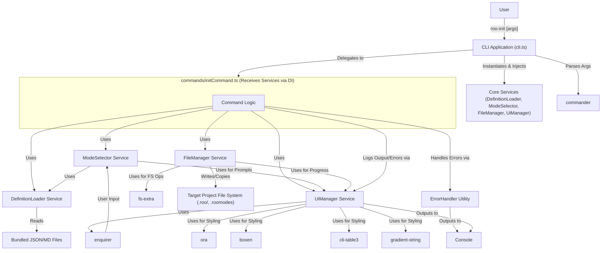

# Roo Init CLI Architecture Document

## Technical Summary

The Roo Init CLI is a Node.js application built with TypeScript, designed to streamline project initialization. It allows developers to select predefined 'modes' and associated 'rules' (guideline files) through interactive prompts or command-line arguments. The tool then copies the selected mode definitions into a `.roomodes` JSON file and the corresponding rule files into a standardized `.roo` directory structure within the target project. Key technologies include `commander` for argument parsing, `enquirer` for interactive prompts, `fs-extra` for robust file system operations, and libraries like `ora`, `boxen`, `cli-table3`, and `gradient-string` for an enhanced CLI user experience. The architecture emphasizes modularity and Dependency Injection (DI) for core services, separating concerns between command handling, core logic (definition loading, mode selection, file management), and UI/utilities. This aims for high maintainability, testability, and suitability for AI agent implementation, aligning with the goals outlined in the PRD ([`docs/prd.md:9`](docs/prd.md:9)).

## High-Level Overview

The Roo Init CLI follows a **Modular Monolith** architectural style suitable for a command-line tool. It operates as a single executable process but is internally structured into distinct, loosely coupled modules.

The primary user interaction flow is as follows:
1.  User executes the `roo-init` command in their terminal within a target project directory.
2.  The CLI application starts ([`src/cli.ts`](src/cli.ts:0)). Core services (DefinitionLoader, ModeSelector, FileManager, UiManager) are instantiated.
3.  `commander` parses command-line arguments (`--help`, `--version`, `--modes`, `--category`, `--force`).
4.  The `InitCommand` handler receives necessary services via DI.
5.  Core definitions (modes, categories, rules) are loaded by the `DefinitionLoader` service from bundled JSON files.
6.  Based on parsed arguments:
    *   If `--help` or `--version`, display relevant info (potentially styled by `UiManager`) and exit.
    *   If `--modes` or `--category` are provided (non-interactive), the `ModeSelector` service validates slugs and resolves the final mode list.
    *   Otherwise (interactive), the `ModeSelector` service uses `enquirer` (via `UiManager`) to prompt the user for category and mode selection.
7.  The `FileManager` service handles file operations, using `UiManager` for progress indicators (e.g., `ora` spinners):
    *   Checks for existing files/directories.
    *   Creates the `.roo` directory structure if needed.
    *   Writes the `.roomodes` JSON file.
    *   Copies relevant rule files (`.md`) into `.roo/rules/` and `.roo/rules-[mode_slug]/`.
    *   Respects the `--force` flag for overwriting.
8.  Feedback (progress with `ora` spinners, success/error messages styled with `boxen` and `gradient-string`, tabular data with `cli-table3`) is provided to the user via the console, managed by the `UiManager` and `ErrorHandler` utilities.



## Component View

The application is structured into several key components located within the `src/` directory, promoting separation of concerns, testability, and clear DI pathways.

```mermaid
graph TD
    subgraph CLI_Main ["src/cli.ts"]
        CLI_Entry["cli.ts (commander setup, DI Root)"]
    end

    subgraph Commands ["src/commands/"]
        InitCommand["initCommand.ts (Receives dependencies)"]
    end

    subgraph Core_Services ["src/core/ (Injectable Services)"]
        DefLoader["DefinitionLoader.ts"]
        ModeSel["ModeSelector.ts"]
        FileMgr["FileManager.ts"]
    end

    subgraph Utilities ["src/utils/"]
        Logger["logger.ts (Basic Logging)"]
        UIManager["uiManager.ts (enquirer, ora, boxen, cli-table3, gradient-string)"]
        ErrHandler["errorHandler.ts"]
    end

    subgraph SharedTypes ["src/types/"]
        DomainTypes["domain.ts"]
    end

    subgraph ExternalLibs [External Libraries]
        YargsLib["commander"]
        EnquirerLib["enquirer"]
        OraLib["ora"]
        BoxenLib["boxen"]
        CliTableLib["cli-table3"]
        GradientLib["gradient-string"]
        FsExtraLib["fs-extra"]
    end

    subgraph Data [Bundled Data]
        JsonDefs["definitions/*.json"]
        RuleFiles["definitions/rules/**/*.md"]
    end

    CLI_Entry -- Instantiates & Injects --> DefLoader;
    CLI_Entry -- Instantiates & Injects --> ModeSel;
    CLI_Entry -- Instantiates & Injects --> FileMgr;
    CLI_Entry -- Instantiates & Injects --> UIManager;
    CLI_Entry -- Instantiates & Injects --> Logger;
    CLI_Entry -- Instantiates & Injects --> ErrHandler;
    
    CLI_Entry -- Configures & Delegates to --> InitCommand;
    InitCommand -- Uses (Injected) --> ModeSel;
    InitCommand -- Uses (Injected) --> FileMgr;
    InitCommand -- Uses (Injected) --> DefLoader;
    InitCommand -- Uses (Injected) --> UIManager;
    InitCommand -- Uses (Injected) --> Logger;
    InitCommand -- Uses (Injected) --> ErrHandler;

    ModeSel -- Uses (Injected) --> DefLoader;
    ModeSel -- Uses (Injected) --> UIManager; # For enquirer prompts
    ModeSel -- Uses --> DomainTypes;

    FileMgr -- Uses (Injected) --> UIManager; # For progress indicators
    FileMgr -- Uses --> FsExtraLib;
    FileMgr -- Uses (Injected) --> DefLoader; 
    FileMgr -- Uses --> DomainTypes;

    UIManager -- Uses --> EnquirerLib;
    UIManager -- Uses --> OraLib;
    UIManager -- Uses --> BoxenLib;
    UIManager -- Uses --> CliTableLib;
    UIManager -- Uses --> GradientLib;

    DefLoader -- Reads --> JsonDefs;
    DefLoader -- Reads --> RuleFiles;
    DefLoader -- Uses --> DomainTypes;

    CLI_Entry -- Uses --> YargsLib;

    style Core_Services fill:#f9f,stroke:#333,stroke-width:2px
    style Commands fill:#ccf,stroke:#333,stroke-width:2px
    style Utilities fill:#cfc,stroke:#333,stroke-width:2px
    style ExternalLibs fill:#ffc,stroke:#333,stroke-width:2px
```

- **`src/cli.ts`**: Entry point. Initializes `commander`, defines commands (`init`, `--help`, `--version`). Acts as the DI root, instantiating core services and utilities and injecting them into command handlers.
- **`src/commands/initCommand.ts`**: Orchestrates the main initialization workflow. Receives instances of core services (e.g., `DefinitionLoader`, `ModeSelector`, `FileManager`) and utilities (e.g., `UiManager`, `ErrorHandler`) via constructor or method injection. Determines if running interactively or non-interactively. Uses injected services for their respective tasks and `UiManager` for all user-facing console output.
- **`src/core/DefinitionLoader.ts`**: Responsible for finding, reading, parsing, and validating the bundled mode, category, and rule definition files. Designed to be injectable and easily testable.
- **`src/core/ModeSelector.ts`**: Encapsulates the logic for selecting modes. Takes `DefinitionLoader` and `UiManager` (for `enquirer` prompts) as injected dependencies. Handles both interactive and non-interactive selection. Designed to be injectable.
- **`src/core/FileManager.ts`**: Handles all interactions with the target project's file system. Takes `UiManager` (for progress indicators like `ora` spinners) and `DefinitionLoader` (to get rule file info) as injected dependencies. Uses `fs-extra`. Designed to be injectable.
- **`src/utils/`**:
    - `logger.ts`: Provides basic, unstyled logging capabilities, potentially as a fallback or for internal debugging if `UiManager` is not suitable.
    - `uiManager.ts`: Centralizes the usage of `enquirer`, `ora`, `boxen`, `cli-table3`, and `gradient-string` to provide a consistent, rich, and visually appealing CLI user experience for prompts, spinners, messages, and tables.
    - `errorHandler.ts`: Centralized error handling, formatting user-friendly error messages (possibly using `boxen`), and managing exit codes.
- **`src/types/`**: Defines shared TypeScript interfaces, primarily the domain model based on [`docs/data-models.md`](docs/data-models.md:0).

## Key Architectural Decisions & Patterns

- **Modular Monolith:** Chosen for simplicity suitable for a CLI tool, while internal modules provide structure.
- **Dependency Injection (DI):** Core services (`DefinitionLoader`, `FileManager`, `ModeSelector`) and key utilities (`UiManager`, `ErrorHandler`, `Logger`) are designed to be injectable. They will be instantiated in a central place (e.g., [`src/cli.ts`](src/cli.ts:0)) and passed to their consumers (e.g., command handlers). This significantly enhances testability by allowing easy mocking of dependencies and improves modularity.
- **Service Layer (`src/core/`)**: Core logic is encapsulated in dedicated, injectable services.
- **Command Pattern (via `commander`):** `commander` maps CLI commands to handlers. Handlers receive dependencies via DI.
- **TypeScript:** Enforces static typing. Justification: PRD requirement, improves code quality, maintainability, and AI agent interaction.
- **`commander` for Argument Parsing:** Robust parsing, validation, help text. Justification: PRD recommendation, industry standard.
- **`enquirer` for Interactive Prompts:** User-friendly, customizable prompts. Justification: User feedback, robust features.
- **CLI UI/UX Enhancement Libraries (`ora`, `boxen`, `cli-table3`, `gradient-string`):** Managed via `UiManager` for a polished user experience. Justification: Improves usability and professional appearance.
- **`fs-extra` for File Operations:** Robust file system interactions. Justification: Reliability, cross-platform compatibility.
- **Bundled Definitions (JSON/MD):** Self-contained operation. Justification: Meets requirements, simple deployment.
- **Centralized UI Management (`src/utils/uiManager.ts`):** Consolidates CLI output styling and interaction logic.
- **Centralized Error Handling (`src/utils/errorHandler.ts`):** Consistent error reporting and exit codes.

## Core Workflow / Sequence Diagrams (Optional)

*(Consider adding a sequence diagram for the interactive `init` flow later if needed for clarity, showing DI)*

## Infrastructure and Deployment Overview

- **Cloud Provider(s):** N/A (Local CLI Tool)
- **Core Services Used:** N/A
- **Infrastructure as Code (IaC):** N/A
- **Deployment Strategy:** Packaged as an npm module and published to a registry (e.g., npmjs.com) for installation via `npm install -g roo-init` or `pnpm add -g roo-init`.
  - **Build Process:** `tsc` compiles TypeScript to JavaScript (`build/`), and definition files (`definitions/`) are copied to `build/definitions/`. `package.json` points `bin` to `build/bin/roo-init.js`.
- **Environments:** Primarily `development` (local) and `production` (published npm package).

## Key Reference Documents

- [`docs/prd.md`](docs/prd.md:0)
- [`docs/epic1.md`](docs/epic1.md:0)
- [`docs/epic2.md`](docs/epic2.md:0)
- [`docs/tech-stack.md`](docs/tech-stack.md:0)
- [`docs/project-structure.md`](docs/project-structure.md:0)
- [`docs/coding-standards.md`](docs/coding-standards.md:0)
- [`docs/data-models.md`](docs/data-models.md:0)
- [`docs/environment-vars.md`](docs/environment-vars.md:0)
- [`docs/testing-strategy.md`](docs/testing-strategy.md:0)
- [`specs/consolidated_domain_model.md`](../specs/consolidated_domain_model.md)

## Change Log

| Change        | Date       | Version | Description                  | Author         |
| ------------- | ---------- | ------- | ---------------------------- | -------------- |
| Initial draft | 2025-05-12 | 0.1     | Initial architecture draft   | Architect Agent |
| Revision      | 2025-05-12 | 0.2     | Updated tech stack (enquirer, UI libs), emphasized DI, refined component descriptions and interactions. | Architect Agent |